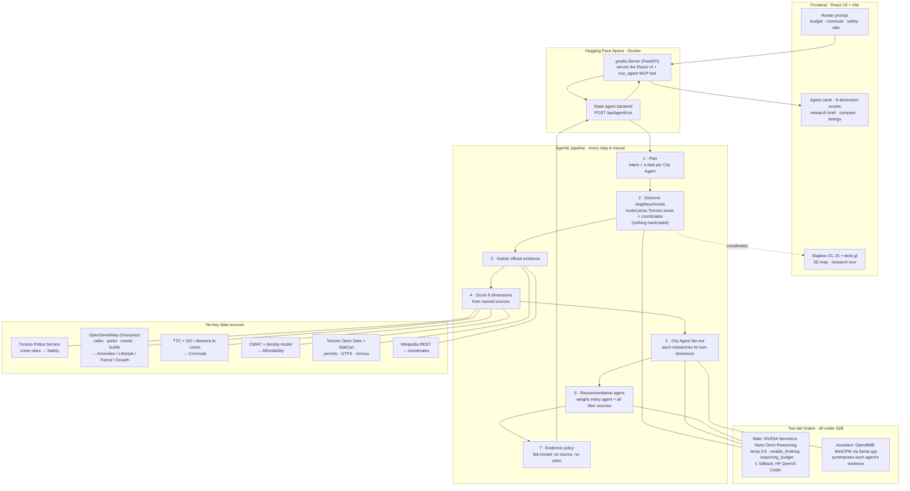

# 6ixPulse

6ixPulse is an agentic Toronto housing intelligence map for renters who do not want to choose a neighborhood from vibes, stale listicles, or one-off anecdotes.

## Why I Built This

I am looking to move, and moving means doing a lot of research before committing to a place. Rent is only one part of the decision. I also need to understand commute time, safety signals, neighborhood feel, access to daily needs, and whether an area is getting better or just getting more expensive.

6ixPulse turns that research process into a map-first agent workflow. I can ask something like:

```text
I want to move to Toronto, make $110000, work at Union Station, need safe streets,
cafes, and rent under $2600.
```

The app then ranks Toronto neighborhoods, animates the map to the areas it is researching, and dispatches specialized agents for affordability, commute, safety, lifestyle, future growth, and final recommendation.

## What It Does

- **Plans first.** Before any agent works, the model lays out a task for each City Agent and the source it will use.
- **Discovers neighbourhoods.** The agentic model picks the Toronto areas that fit the prompt and supplies their coordinates — nothing about the candidate set is hardcoded; the map draws what the model found.
- **Scores all eight dimensions** — Affordability, Safety, Commute, Transit, Amenities, Lifestyle, Growth, and an overall Match — for every candidate, each computed from a real, named, no-key source.
- **Fans out a researcher per City Agent.** Affordability, Commute, Safety, Lifestyle and Growth agents each reason over only their own evidence; a **Recommendation agent runs last** with every agent's finding *and* all of their sources.
- **Fails closed.** The UI withholds a rent, commute, safety, growth claim, or score unless the backend can tie it to source evidence — sources are named, never "S1".
- **Shows a real Mapbox GL JS 3D map** with a research tour that zooms into each area while it is being researched, then flies out-and-in to the next.
- **Two-tier brains, all < 32B.** NVIDIA Nemotron Nano Omni Reasoning is the main model (with `enable_thinking`); the small OpenBMB model on llama.cpp assists with summarisation. Falls back to HF when a provider is unavailable.

## Architecture



## Tech Stack

- Frontend: React 19, TypeScript, Vite
- Map: Mapbox GL JS, custom Mapbox style, deck.gl
- UI: custom CSS, lucide-react icons, map-matched monochrome palette
- Backend: Node HTTP server
- Space wrapper: `gradio.Server` on FastAPI, Docker Space
- Agent orchestration: plan → discover → research → score → fan-out → recommend, fully traced
- Data: Toronto Open Data, Toronto Police, OpenStreetMap (Overpass), CMHC, StatCan, Wikipedia — all no-key
- Models (all < 32B):
  - Main agentic brain: `nvidia/nemotron-3-nano-omni-30b-a3b-reasoning` (build.nvidia.com)
  - Summarisation assistant: OpenBMB MiniCPM via llama.cpp (`openbmb/MiniCPM4-*-GGUF`)
  - Fallback: `Qwen/Qwen3-Coder-30B-A3B-Instruct` on the HF Router

## Build Small Hackathon Readiness

The official Build Small Field Guide requires every model to stay under 32B parameters, a Gradio app in the Build Small Hugging Face org, a demo video, a social post, and README tags/write-up.

| Requirement | Status | Notes |
| --- | --- | --- |
| Model under 32B | On track | Primary model is `nvidia/Nemotron-3-Nano-Omni-30B-A3B-Reasoning-BF16`. The NVIDIA model card describes it as a 31B / A3B MoE with about 3B active parameters per token. |
| Practical track | On track | This fits Backyard AI: a personal daily-life tool for choosing where to live. |
| Agentic app | On track | Multi-step planning, tool use, domain-scoped search, evidence policy, and model synthesis. |
| Custom UI | On track | The app is a custom map-first interface rather than default Gradio components. |
| README tags | Done | Tags are in the YAML block at the top of this README. |
| Codex prize | On track | This repo is being prepared and pushed through Codex. Keep Codex-attributed commits in the connected GitHub repo or Space history. |
| Gradio Space | Uploaded | Live Space: https://huggingface.co/spaces/build-small-hackathon/6ixPulse. Add Space secrets before judging so Mapbox and NVIDIA calls are live. |
| Demo video | Pending | Add a public demo video link before submission. |
| Social post | Pending | Add a social post link before submission. |

Suggested target categories:

- Backyard AI
- Best Agent
- Best Use of Codex
- Off Brand
- Best Demo, once the demo video and social post are ready

## Runtime Flow

1. The user writes a housing prompt in the Ask 6ixPulse composer; the frontend calls `POST /api/agent/run`.
2. **Plan** — the model parses intent (budget, commute cap, priority weights) and lays out a task for each City Agent.
3. **Discover** — the model names the Toronto neighbourhoods that fit and supplies their coordinates. No candidate list is hardcoded; the map renders what the model returns.
4. **Gather evidence** — official Toronto data is pulled per area: Toronto Police crime rates, building permits, TTC GTFS, StatCan, and Wikipedia coordinates.
5. **Score** — for every candidate, all eight dimensions are computed from named sources (see below) and a weighted Match.
6. **Fan-out** — each City Agent reasons over only its dimension's evidence; the **Recommendation agent runs last** with every finding and all sources, using the reasoning model's thinking mode.
7. **Evidence policy** — any claim without a matched source or computed fact is hidden ("needs source").
8. The map, agent cards, 8-dimension scores, research brief, and comparison update from the same structured, source-cited result.

## Source-Backed Display Policy

6ixPulse intentionally fails closed.

Local neighborhood rows seed the workflow, but they are not treated as truth. The app does not present a rent range, commute score, safety claim, growth claim, or final agent score unless the backend can connect that category to source evidence or computed facts.

This matters because housing decisions are high-stakes. A pretty map with fake confidence is worse than a map that admits where research is incomplete.

## Data Sources & Scoring

Every dimension shown in the UI is computed from a real, no-key source and labelled with that source's name (never "S1"):

| Dimension | Source |
| --- | --- |
| Safety | **Toronto Police Service** — Neighbourhood Crime Rates (Toronto Open Data) |
| Commute | **Distance to Union Station** over the TTC + GO (Metrolinx) network |
| Transit | **TTC** stops & stations via **OpenStreetMap** |
| Amenities · Lifestyle · Growth | **OpenStreetMap (Overpass)** — cafés, restaurants, parks, groceries, construction sites |
| Affordability | **CMHC** rental-market context + a distance-to-core / density model |
| Match | weighted blend of the above, against the renter's stated priorities |
| Coordinates | **Wikipedia REST** (for placing discovered areas on the map) |

These are all official public APIs, so the hosted Space runs **without any scraping or bypass tooling**. Optional keyed web search (Google CSE, SerpAPI, Brave, Tavily) can be enabled for extra context, but it is off by default and never required.

## Models

Two tiers, both under 32B parameters:

```bash
# Main agentic brain: NVIDIA Nemotron Nano Omni Reasoning (build.nvidia.com).
# Used for discovery, the per-agent findings, and the final recommendation (with thinking).
AGENT_MODEL_PROVIDER=auto              # tries Nemotron first, then HF
NVIDIA_API_KEY=your_nvapi_key
NVIDIA_MODEL=nvidia/nemotron-3-nano-omni-30b-a3b-reasoning
NVIDIA_BASE_URL=https://integrate.api.nvidia.com/v1
NVIDIA_ENABLE_THINKING=1              # temperature 0.6, top_p 0.95, reasoning_budget

# Summarisation assistant: small OpenBMB model through the llama.cpp runtime.
LLAMACPP_ENABLED=1
LLAMACPP_MODEL=openbmb/MiniCPM4-0.5B  # or MiniCPM4-8B-GGUF for stronger summaries
AGENT_SUMMARIZER_PROVIDER=llamacpp

# Fallback when no key/runtime is available, so the app always responds.
HF_TOKEN=your_hugging_face_token
HF_MODEL=Qwen/Qwen3-Coder-30B-A3B-Instruct
```

The reasoning model uses the Nemotron recipe (matching `ChatNVIDIA`): `temperature=0.6`, `top_p=0.95`, `chat_template_kwargs={"enable_thinking": true}`, and a `reasoning_budget`; its `<think>` reasoning is captured separately from the JSON answer. Thinking is enabled only for the decisions (discovery, recommendation, synthesis), and the per-agent fan-out runs in parallel on hosted APIs, so a full run stays within the response budget.

## Gradio Space

This repo is prepared for a Docker-backed Gradio Space using `gradio.Server`, which is designed for custom frontends like React while still giving the project Gradio's API engine, queuing, MCP support, and Hugging Face Spaces hosting.

Live Space:

```text
https://huggingface.co/spaces/build-small-hackathon/6ixPulse
```

The Space entrypoint is:

```text
app.py
```

What it does:

- starts the Node agent backend on `127.0.0.1:8787`
- serves the built React app from `dist/`
- injects runtime Mapbox config from Space secrets
- proxies the existing frontend calls to `/api/agent/run`
- exposes a Gradio API endpoint and MCP tool named `/run_agent`

Required Space secrets:

```bash
VITE_MAPBOX_TOKEN=your_mapbox_token
NVIDIA_API_KEY=your_nvidia_api_key
```

Local secrets are intentionally not committed or uploaded. Add these in the Space settings before final judging.

Recommended Space variables (the Docker image already sets these):

```bash
AGENT_MODEL_PROVIDER=auto
NVIDIA_MODEL=nvidia/nemotron-3-nano-omni-30b-a3b-reasoning
NVIDIA_BASE_URL=https://integrate.api.nvidia.com/v1
NVIDIA_ENABLE_THINKING=1
AGENT_DISCOVER=1
AGENT_FANOUT=1
SEARCH_PROVIDER=disabled        # official-data-only; no scraping on the hosted Space
OFFICIAL_DATA_ENABLED=1
```

Local Space-style run:

```bash
npm install
npm run build
python -m venv .venv
source .venv/bin/activate
pip install -r requirements.txt
python app.py
```

Open:

```text
http://127.0.0.1:7860/
```

## Running Locally

```bash
npm install
cp .env.example .env
npm run dev:full
```

Open:

```text
http://127.0.0.1:5173/
```

Set your Mapbox token before running:

```bash
VITE_MAPBOX_TOKEN=your_token_here
VITE_MAPBOX_STYLE_URL=mapbox://styles/ownpath/cmqe4wg8h005001s4bjx9461m
```

Run services separately:

```bash
npm run dev:api
npm run dev
```

Health checks:

```bash
curl http://127.0.0.1:8787/api/agent/health
curl http://127.0.0.1:8787/api/agent/search/health
```

## Project Structure

```text
app.py                         Gradio Server wrapper for the Space runtime
Dockerfile                     Docker Space image with Node + Python
src/App.tsx                    app shell, agent panels, scores, listings
src/components/MapCanvas.tsx   Mapbox/deck.gl map + research tour
src/lib/agentApi.ts            frontend API client types
server/index.mjs               agent API server; orchestrates the pipeline
server/discover.mjs            model-driven neighbourhood discovery (+ coordinates)
server/score-tools.mjs         8-dimension scoring from named no-key sources
server/agent-fanout.mjs        per-agent City Agents + Recommendation agent
server/model-chat.mjs          provider routing: main brain vs. summariser
server/agent-core.mjs          plan, trace, and the fail-closed evidence policy
server/research-tools.mjs      Toronto Open Data + crime rates + coordinates
server/nvidia-client.mjs       NVIDIA Nemotron (reasoning) client
server/llamacpp-client.mjs     llama.cpp / OpenBMB client
server/hf-client.mjs           Hugging Face Router fallback client
scripts/dev-full.mjs           starts frontend and backend together
scripts/llama-server.sh        launches a local OpenBMB GGUF via llama.cpp
```

## Verification

```bash
node --check server/open-websearch-mcp.mjs
node --check server/research-tools.mjs
node --check server/index.mjs
npm run build
```

Current local verification:

- Node syntax checks pass.
- TypeScript + Vite production build passes.
- Browser UI check: map-focus mode collapses the side panels into edge tabs and restores them.

## Submission To Finish

Before final Build Small submission:

1. Add `VITE_MAPBOX_TOKEN` and `NVIDIA_API_KEY` in the Hugging Face Space secrets panel.
2. Wait for the Docker Space build to finish and confirm the live map loads.
3. Record and link a demo video.
4. Publish and link a social post.
5. Add `NVIDIA_API_KEY` (nvapi-…) to run Nemotron (`nvidia/nemotron-3-nano-omni-30b-a3b-reasoning`), or run a small GGUF locally via `npm run llama:serve` (llama.cpp / OpenBMB).
6. Keep the GitHub repo or Space history connected with Codex-attributed commits for the Codex prize.
