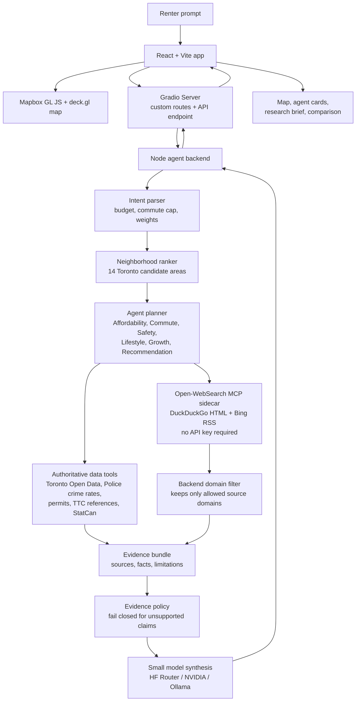

# 6ixPulse

6ixPulse is an agentic Toronto housing intelligence map for renters who do not want to choose a neighborhood from vibes, stale listicles, or one-off anecdotes.

## Why I Built This

I am looking to move, and moving means doing a lot of research before committing to a place. Rent is only one part of the decision. I also need to understand commute time, safety signals, neighborhood feel, access to daily needs, and whether an area is getting better or just getting more expensive.

6ixPulse turns that research process into a map-first agent workflow. I can ask something like:

```text
I want to move to Toronto, make $110000, work at Union Station, need safe streets,
cafes, and rent under $2600.
```

The app then ranks Toronto neighborhoods, animates the map to the areas it is researching, and dispatches specialized agents for affordability, commute, safety, lifestyle, future growth, and final recommendation.

## What It Does

- Shows a real Mapbox GL JS Toronto map with 3D building context and deck.gl overlays.
- Parses the renter prompt into budget, commute cap, and priority weights.
- Ranks candidate neighborhoods against those priorities.
- Spawns category agents:
  - Affordability
  - Commute
  - Safety Signals
  - Lifestyle
  - Future Growth
  - Recommendation
- Runs contextual web research through a no-key MCP search sidecar.
- Checks official Toronto sources first, including Toronto Open Data and Toronto Police neighborhood crime-rate data.
- Uses a source-backed display policy: the UI withholds rents, commute claims, safety claims, and scores unless matching evidence or computed facts exist.
- Animates a research tour across the top areas so the map zooms to the places being evaluated.
- Supports Hugging Face Router, NVIDIA NIM, Ollama, and deterministic local fallback.

## Architecture



## Tech Stack

- Frontend: React 19, TypeScript, Vite
- Map: Mapbox GL JS, custom Mapbox style, deck.gl
- UI: custom CSS, lucide-react icons, map-matched monochrome palette
- Backend: Node HTTP server
- Space wrapper: `gradio.Server` on FastAPI, Docker Space
- Agent orchestration: local tool trace plus model synthesis
- Web research: bundled MCP-compatible no-key search server
- Models:
  - Primary hackathon model: `nvidia/Nemotron-3-Nano-Omni-30B-A3B-Reasoning-BF16`
  - Optional HF Router fallback: `Qwen/Qwen3-Coder-30B-A3B-Instruct`
  - Optional local path: Ollama OpenAI-compatible endpoint

## Build Small Hackathon Readiness

The official Build Small Field Guide requires every model to stay under 32B parameters, a Gradio app in the Build Small Hugging Face org, a demo video, a social post, and README tags/write-up.

| Requirement | Status | Notes |
| --- | --- | --- |
| Model under 32B | On track | Primary model is `nvidia/Nemotron-3-Nano-Omni-30B-A3B-Reasoning-BF16`. The NVIDIA model card describes it as a 31B / A3B MoE with about 3B active parameters per token. |
| Practical track | On track | This fits Backyard AI: a personal daily-life tool for choosing where to live. |
| Agentic app | On track | Multi-step planning, tool use, domain-scoped search, evidence policy, and model synthesis. |
| Custom UI | On track | The app is a custom map-first interface rather than default Gradio components. |
| README tags | Done | Tags are in the YAML block at the top of this README. |
| Codex prize | On track | This repo is being prepared and pushed through Codex. Keep Codex-attributed commits in the connected GitHub repo or Space history. |
| Gradio Space | Uploaded | Live Space: https://huggingface.co/spaces/build-small-hackathon/6ixPulse. Add Space secrets before judging so Mapbox and NVIDIA calls are live. |
| Demo video | Pending | Add a public demo video link before submission. |
| Social post | Pending | Add a social post link before submission. |

Suggested target categories:

- Backyard AI
- Best Agent
- Best Use of Codex
- Off Brand
- Best Demo, once the demo video and social post are ready

## Runtime Flow

1. The user writes a housing prompt in the Ask 6ixPulse composer.
2. The frontend calls `POST /api/agent/run`.
3. The backend parses intent and ranks local Toronto candidate neighborhoods.
4. The research planner creates contextual, agent-specific searches:
   - affordability: listings, average rent, rent market
   - commute: TTC and commute-to-destination context
   - safety: official crime/safety and resident discussion
   - lifestyle: cafes, groceries, parks, restaurants, reviews
   - growth: development, permits, planning, market trend
   - recommendation: pros/cons and neighborhood guides
5. Official data and MCP web-search results are normalized into sources and facts.
6. Domain filters remove polluted search results that do not match the intended source set.
7. The evidence policy hides unsupported user-facing claims.
8. The selected small model synthesizes strict JSON for recommendations.
9. The map and agent panels update from the same structured result.

## Source-Backed Display Policy

6ixPulse intentionally fails closed.

Local neighborhood rows seed the workflow, but they are not treated as truth. The app does not present a rent range, commute score, safety claim, growth claim, or final agent score unless the backend can connect that category to source evidence or computed facts.

This matters because housing decisions are high-stakes. A pretty map with fake confidence is worse than a map that admits where research is incomplete.

## Web Research

The default search provider is:

```bash
SEARCH_PROVIDER=mcp_open_websearch
MCP_WEB_SEARCH_ENABLED=1
MCP_WEB_SEARCH_TIMEOUT_MS=6000
MCP_WEB_SEARCH_TOOL=web_search
RESEARCH_DEPTH=standard
RESEARCH_MAX_QUERIES=6
RESEARCH_RESULTS_PER_QUERY=3
RESEARCH_TOTAL_TIMEOUT_MS=45000
```

The bundled sidecar lives at:

```text
server/open-websearch-mcp.mjs
```

It exposes a `web_search` MCP tool and searches public DuckDuckGo HTML plus Bing RSS without an API key. Public search can still be rate-limited or incomplete, so the backend applies domain filtering and keeps limitations in the research payload.

The hosted Space uses bounded search defaults so public no-key search does not block the agent response. For slower, deeper research runs, increase `RESEARCH_MAX_QUERIES`, `RESEARCH_TOTAL_TIMEOUT_MS`, and `MCP_WEB_SEARCH_TIMEOUT_MS`, or switch to an API-backed provider.

Optional API providers remain supported:

```bash
SEARCH_PROVIDER=google
GOOGLE_SEARCH_API_KEY=your_google_search_key
GOOGLE_SEARCH_CX=your_google_programmable_search_engine_id
SERPAPI_API_KEY=your_serpapi_key
BRAVE_SEARCH_API_KEY=your_brave_key
TAVILY_API_KEY=your_tavily_key
```

## Models

Primary NVIDIA config:

```bash
AGENT_MODEL_PROVIDER=nvidia
NVIDIA_API_KEY=your_nvidia_api_key
NVIDIA_MODEL=nvidia/Nemotron-3-Nano-Omni-30B-A3B-Reasoning-BF16
NVIDIA_BASE_URL=https://integrate.api.nvidia.com/v1
NVIDIA_ENABLE_THINKING=1
```

Optional Hugging Face Router fallback:

```bash
AGENT_MODEL_PROVIDER=hf
HF_TOKEN=your_hugging_face_token
HF_MODEL=Qwen/Qwen3-Coder-30B-A3B-Instruct
HF_CHAT_COMPLETIONS_URL=https://router.huggingface.co/v1/chat/completions
HF_REASONING_EFFORT=medium
```

Optional local Ollama config:

```bash
AGENT_MODEL_PROVIDER=ollama
OLLAMA_MODEL=qwen3:8b
OLLAMA_HOST=http://127.0.0.1:11434
```

If a token, model, or provider is unavailable, the API returns a deterministic local result so the UI remains usable.

## Gradio Space

This repo is prepared for a Docker-backed Gradio Space using `gradio.Server`, which is designed for custom frontends like React while still giving the project Gradio's API engine, queuing, MCP support, and Hugging Face Spaces hosting.

Live Space:

```text
https://huggingface.co/spaces/build-small-hackathon/6ixPulse
```

The Space entrypoint is:

```text
app.py
```

What it does:

- starts the Node agent backend on `127.0.0.1:8787`
- serves the built React app from `dist/`
- injects runtime Mapbox config from Space secrets
- proxies the existing frontend calls to `/api/agent/run`
- exposes a Gradio API endpoint and MCP tool named `/run_agent`

Required Space secrets:

```bash
VITE_MAPBOX_TOKEN=your_mapbox_token
NVIDIA_API_KEY=your_nvidia_api_key
```

Local secrets are intentionally not committed or uploaded. Add these in the Space settings before final judging.

Recommended Space variables:

```bash
AGENT_MODEL_PROVIDER=nvidia
NVIDIA_MODEL=nvidia/Nemotron-3-Nano-Omni-30B-A3B-Reasoning-BF16
NVIDIA_BASE_URL=https://integrate.api.nvidia.com/v1
NVIDIA_ENABLE_THINKING=1
SEARCH_PROVIDER=mcp_open_websearch
MCP_WEB_SEARCH_ENABLED=1
MCP_WEB_SEARCH_TIMEOUT_MS=6000
RESEARCH_DEPTH=standard
RESEARCH_MAX_QUERIES=6
RESEARCH_RESULTS_PER_QUERY=3
RESEARCH_TOTAL_TIMEOUT_MS=45000
```

Local Space-style run:

```bash
npm install
npm run build
python -m venv .venv
source .venv/bin/activate
pip install -r requirements.txt
python app.py
```

Open:

```text
http://127.0.0.1:7860/
```

## Running Locally

```bash
npm install
cp .env.example .env
npm run dev:full
```

Open:

```text
http://127.0.0.1:5173/
```

Set your Mapbox token before running:

```bash
VITE_MAPBOX_TOKEN=your_token_here
VITE_MAPBOX_STYLE_URL=mapbox://styles/ownpath/cmqe4wg8h005001s4bjx9461m
```

Run services separately:

```bash
npm run dev:api
npm run dev
```

Health checks:

```bash
curl http://127.0.0.1:8787/api/agent/health
curl http://127.0.0.1:8787/api/agent/search/health
```

## Project Structure

```text
app.py                         Gradio Server wrapper for Space runtime
Dockerfile                     Docker Space image with Node + Python
src/App.tsx                    main app shell and agent panels
src/components/MapCanvas.tsx   Mapbox/deck.gl map experience
src/data/neighborhoods.ts      Toronto candidate seed data
src/lib/scoring.ts             prompt parsing and local ranking
src/lib/agentApi.ts            frontend API client types
server/index.mjs               local agent API server
server/agent-core.mjs          local tool loop, trace, evidence policy
server/research-tools.mjs      official data + web research planner
server/open-websearch-mcp.mjs  no-key MCP web-search sidecar
server/hf-client.mjs           Hugging Face Router client
server/nvidia-client.mjs       NVIDIA NIM client
server/ollama-client.mjs       Ollama client
scripts/dev-full.mjs           starts frontend and backend together
```

## Verification

```bash
node --check server/open-websearch-mcp.mjs
node --check server/research-tools.mjs
node --check server/index.mjs
npm run build
```

Current local verification:

- Node syntax checks pass.
- TypeScript + Vite production build passes.
- Browser UI check: map-focus mode collapses the side panels into edge tabs and restores them.

## Submission To Finish

Before final Build Small submission:

1. Add `VITE_MAPBOX_TOKEN` and `NVIDIA_API_KEY` in the Hugging Face Space secrets panel.
2. Wait for the Docker Space build to finish and confirm the live map loads.
3. Record and link a demo video.
4. Publish and link a social post.
5. Add `NVIDIA_API_KEY` (nvapi-…) to run Nemotron (`nvidia/nemotron-3-nano-omni-30b-a3b-reasoning`), or run a small GGUF locally via `npm run llama:serve` (llama.cpp / OpenBMB).
6. Keep the GitHub repo or Space history connected with Codex-attributed commits for the Codex prize.
